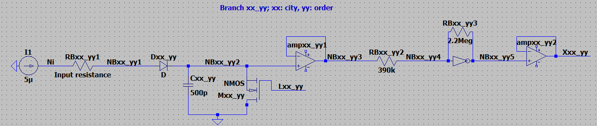

# TSP PPUF software
Analog simulations based on the TSP CMOS solver from: https://doi.org/10.1038/s41598-020-77617-7

# Usage
Netlists are made to work with LTspice 24.1.9: https://www.analog.com/en/resources/design-tools-and-calculators/ltspice-simulator.html
### Upon download, you will have to change some file paths for the software to work on your machine:
First, the bsim.txt and Inv folder in the SpiceComponents folder of this repository will have to be added to the LTspice\SpiceComponents\ directory in your LTspice download.

Next, the path to the bsim.txt file in the end_list function of the Gen_TSP_Netlist_Class.py file will have to be changed to point to its location in your LTspice download.
In the same function, you will have to modifiy the path locations of the standard.dio and standard.mos files on your machine. 

In the Run_Netlists_Class.py file, you will have to modify the location of the LTspice .exe file in the class __init__.

Finally, in main.py, modify the dir and instance_paths variables to determine where TSP instances, netlists, and simulations will be saved.

Once the software is set up, you can generate TSP instances using the TSP_Gen_Class, which are saved as CSV files. 
These instances can then be read by the Gen_TSP_Netlist_Class, and automatically turned into output netlists in the same directory as the CSV TSP isntance.
Once the netlist is generated, it can be simulated and analyzed using the Run_Netlist_Class.

# Folder structure
The software will generate, and run, netlists for each TSP instance saved in a particular directory. 
For instance, if you have a directory named 10Node, with subdirectories containing 10 node TSP instances named 10Node1, 10Node2, ... , 10Noden, you can automatically generate and run netlists for each TSP by modifying the dir and instance_paths variables in main.py.

# Node naming conventions and circuit structure

## Branch structure:

Above is the structure of the branches in the "Ameoba core". I used op-amps configured as voltage followers instead of the buffers seen in their schematic.

## "Bounceback control" structure:

Above is the structure of the bounceback control/step functions in the output of the IMC. Vt is set to 1.5 V, and -Vt is used as the refrence voltage in the comparator. 

## IMC resistors
Resistors in the IMC follow the naming convention: RIvvkkuull, which connects output Xvv_kk to input LINuu_ll.
